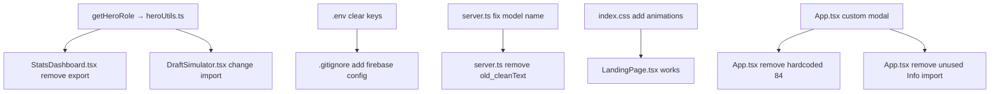

# Design Document: MLBB Audit Fix

## Overview

This design covers a comprehensive audit, bug fix, and UI polish pass for the MLBB Draft Simulator. The changes span security (credential clearing), code quality (dead code removal, import decoupling), UI improvements (custom modal, missing animations, mobile nav), and correctness fixes (model name, hardcoded values, image resolution). No new dependencies are introduced. All changes preserve existing business logic and Indonesian-language UI text.

## Architecture

The application is a React SPA (Vite + Tailwind CSS v4) with an Express backend (`server.ts`) and SQLite persistence. Key architectural layers:

```
┌─────────────────────────────────────────────────┐
│  React Frontend (src/)                          │
│  ├── App.tsx (router/state)                     │
│  ├── components/ (UI components)                │
│  └── lib/ (utilities: heroUtils, firebase)      │
├─────────────────────────────────────────────────┤
│  Express Backend (server.ts)                    │
│  ├── API routes (/api/*)                        │
│  ├── Gemini/OpenAI AI integration               │
│  └── SQLite database (lib/db/)                  │
├─────────────────────────────────────────────────┤
│  Configuration                                  │
│  ├── .env (API keys)                            │
│  ├── firebase-applet-config.json (Firebase)     │
│  └── vite.config.ts / tsconfig.json             │
└─────────────────────────────────────────────────┘
```

Changes are isolated to specific files with minimal cross-cutting concerns. The dependency graph for changes:



## Components and Interfaces

### 1. Credential Cleanup (Requirement 1)

**Files affected:** `.env`, `firebase-applet-config.json`, `.gitignore`

**Changes:**
- `.env`: Replace `OPENAI_API_KEY=sk-618jQ6V076JieqPoBa6a7785CbEe4bDd85513cD6Fb0204F3` with `OPENAI_API_KEY=your_openai_api_key_here`
- `firebase-applet-config.json`: Replace all credential values with placeholder strings:
  ```json
  {
    "projectId": "YOUR_PROJECT_ID",
    "appId": "YOUR_APP_ID",
    "apiKey": "YOUR_API_KEY",
    "authDomain": "YOUR_AUTH_DOMAIN",
    "firestoreDatabaseId": "YOUR_FIRESTORE_DB_ID",
    "storageBucket": "YOUR_STORAGE_BUCKET",
    "messagingSenderId": "YOUR_MESSAGING_SENDER_ID",
    "measurementId": ""
  }
  ```
- `.gitignore`: Add `firebase-applet-config.json` entry (before the `!.env.example` line)

### 2. Fix AI Model Name (Requirement 2)

**File affected:** `server.ts`

**Changes:**
- Replace all occurrences of `"gemini-3.5-flash"` with `"gemini-2.0-flash"` (2 occurrences: in `/api/draft/ai-recommend` and `/api/draft/evaluate`)
- Remove the duplicate `const ai = getGeminiClient();` and `const openAI = getOpenAIClient();` declarations inside the `/api/draft/ai-recommend` try block (lines that shadow the outer declarations). The outer declarations at the top of each endpoint handler are sufficient.

### 3. Dead Code Removal (Requirement 3)

**Files affected:** `src/components/HeroIntelligencePanel.tsx`, `server.ts`, `src/App.tsx`

**Changes:**
- Delete file `src/components/HeroIntelligencePanel.tsx` entirely (never imported anywhere)
- Remove `old_cleanText` function from `server.ts` (lines 93-100 approximately)
- Remove `Info` from the lucide-react import in `src/App.tsx` (change `import { CloudLightning, Info, ShieldCheck }` to `import { CloudLightning, ShieldCheck }`)

### 4. Move getHeroRole to heroUtils (Requirement 4)

**Files affected:** `src/lib/heroUtils.ts`, `src/components/StatsDashboard.tsx`, `src/components/DraftSimulator.tsx`

**Changes in `src/lib/heroUtils.ts`:**
Add the `getHeroRole` function (moved from StatsDashboard):
```typescript
export function getHeroRole(name: string): string {
  if (!name) return "Unknown";
  const nm = String(name).toLowerCase().trim();
  
  const heroData = (heroesMaster as any[]).find(h => 
    h.hero_name.toLowerCase() === nm || 
    (nm.includes("popol") && h.hero_name.toLowerCase().includes("popol"))
  );
  
  if (heroData && heroData.role && heroData.role.length > 0) {
    if (Array.isArray(heroData.role)) {
      return heroData.role[0];
    }
    return heroData.role;
  }
  
  return "Unknown";
}
```

**Changes in `src/components/StatsDashboard.tsx`:**
- Remove the `getHeroRole` function definition (exported function at top of file)
- Add import: `import { getHeroImageUrl, getHeroRole } from "../lib/heroUtils";`
- Remove existing `import { getHeroImageUrl } from "../lib/heroUtils";` (merged into above)

**Changes in `src/components/DraftSimulator.tsx`:**
- Change `import { getHeroRole } from "./StatsDashboard";` to `import { getHeroRole } from "../lib/heroUtils";`

### 5. Add Home Link to Navbar (Requirement 5)

**File affected:** `src/components/Navbar.tsx`

**Changes:**
- Add `Home` entry to the `links` array as the first item:
  ```typescript
  { id: "home", label: "Home", icon: Home }
  ```
- Import `Home` from lucide-react
- Wrap the brand/logo `<div>` in a clickable element that calls `onChangeTab("home")`

### 6. Fix Hero Image Normalization (Requirement 6)

**File affected:** `server.ts` (in `getHeroAssets()` function)

**Changes:**
Add alias mappings after the existing `Wu Zetian → Zetian` alias block:
```typescript
// Hero name alias mappings for special characters
const aliases: Record<string, string> = {
  "yisunshin": "yi sunshin",
  "xborg": "x borg",
  "changé": "change",
  "popol and kupa": "popol kupa",
};

Object.entries(aliases).forEach(([alias, target]) => {
  const normAlias = normalizeName(alias);
  const normTarget = normalizeName(target);
  if (heroAssets[normTarget] && !heroAssets[normAlias]) {
    heroAssets[normAlias] = heroAssets[normTarget];
  }
  if (heroAssets[normAlias] && !heroAssets[normTarget]) {
    heroAssets[normTarget] = heroAssets[normAlias];
  }
});
```

### 7. FallbackImage Minimum Size (Requirement 7)

**File affected:** `src/components/FallbackImage.tsx`

**Changes:**
Add `style={{ minWidth: '24px', minHeight: '24px' }}` to the fallback `<div>` element to guarantee visibility.

### 8. LiquipediaScraper Rate-Limit Handling (Requirement 8)

**File affected:** `src/components/LiquipediaScraper.tsx`

**Changes:**
- Add state: `const [rateLimited, setRateLimited] = useState(false);`
- Add state: `const [cooldown, setCooldown] = useState(0);`
- In the `runScrape` catch block, detect 429 responses and set `rateLimited` state
- Add cooldown timer effect that counts down from 30 when `rateLimited` is true
- Add a status badge element at the top showing: "idle" | "running" | "success" | "error" | "rate-limited"
- The retry button is disabled during the cooldown period
- Display message: "Server sedang membatasi akses (rate limit). Silakan tunggu 30 detik sebelum mencoba lagi."

### 9. Fix Hardcoded History Count (Requirement 9)

**File affected:** `src/App.tsx`

**Changes:**
- Add state: `const [historyData, setHistoryData] = useState<any[]>([]);`
- In `loadAllData`, add fetch to `/api/history` and store result in `historyData`
- Replace `historyCount={84}` with `historyCount={historyData.length}`

### 10. Add Missing CSS Animations (Requirement 10)

**File affected:** `src/index.css`

**Changes:**
Add after the existing `animate-fade-in` block:

```css
/* Fade in with upward slide */
@keyframes fadeInUp {
  from {
    opacity: 0;
    transform: translateY(16px);
  }
  to {
    opacity: 1;
    transform: translateY(0);
  }
}

.animate-fade-in-up {
  animation: fadeInUp 0.5s cubic-bezier(0.16, 1, 0.3, 1) both;
}

/* Gradient position animation for text shimmer */
@keyframes gradientX {
  0%, 100% {
    background-size: 200% 200%;
    background-position: left center;
  }
  50% {
    background-size: 200% 200%;
    background-position: right center;
  }
}

.animate-gradient-x {
  animation: gradientX 3s ease infinite;
}
```

### 11. Custom Confirm Modal (Requirement 11)

**File affected:** `src/App.tsx`

**Changes:**
- Add states: `const [showExitModal, setShowExitModal] = useState(false);` and `const [pendingTab, setPendingTab] = useState<string | null>(null);`
- In `handleTabChange`: replace `window.confirm(...)` with `setShowExitModal(true); setPendingTab(newTab);`
- Add a modal component inline (JSX) rendered conditionally when `showExitModal` is true:
  ```tsx
  {showExitModal && (
    <div className="fixed inset-0 z-[9999] flex items-center justify-center bg-black/80 backdrop-blur-sm">
      <div className="bg-gray-900 border border-gray-700 rounded-xl p-6 max-w-sm w-full mx-4 shadow-2xl">
        <h3 className="text-white font-bold text-lg mb-2">Keluar dari Draft?</h3>
        <p className="text-gray-400 text-sm mb-6">
          Progress draft akan hilang jika anda keluar dari halaman ini.
        </p>
        <div className="flex gap-3 justify-end">
          <button onClick={() => setShowExitModal(false)} className="...">Batal</button>
          <button onClick={() => { setShowExitModal(false); setDraftInProgress(false); setCurrentTab(pendingTab!); setPendingTab(null); }} className="...">Lanjut Keluar</button>
        </div>
      </div>
    </div>
  )}
  ```

### 12. Mobile Navigation Improvements (Requirement 12)

**File affected:** `src/components/Navbar.tsx`

**Changes:**
- For active state in mobile nav, add stronger classes: `border-b-2 border-blue-500` and increase background contrast
- Add `useEffect` + `useRef` to auto-scroll active button into view:
  ```typescript
  const mobileNavRef = useRef<HTMLDivElement>(null);
  useEffect(() => {
    const activeBtn = mobileNavRef.current?.querySelector('[data-active="true"]');
    activeBtn?.scrollIntoView({ behavior: 'smooth', block: 'nearest', inline: 'center' });
  }, [currentTab]);
  ```
- Add `data-active={active ? "true" : "false"}` attribute to mobile nav buttons

### 13. Fix Footer Text (Requirement 13)

**File affected:** `src/App.tsx`

**Changes:**
Replace `"SECURE OFFLINE DESKTOP STATE DEPLOYED"` with `"MLBB Draft Analytics Engine v1.0"`

### 14. Back Button on Hero Detail (Requirement 14)

**File affected:** `src/components/HeroIntelligenceDashboard.tsx`

**Changes:**
The `HeroDetailPanel` already has a close button (X icon) that calls `onClose`. The requirement asks for an explicit "Back" button. Add a secondary back-navigation element in the `HeroDetailPanel` header area (next to the X button) or at the top of the `HeroIntelligenceDashboard` when `selectedHero` is set:

In `HeroIntelligenceDashboard.tsx`, when `selectedHero` is non-null, add a "← Kembali ke daftar" button above or beside the detail panel trigger that calls `setSelectedHero(null)`.

Since `HeroDetailPanel` uses a portal overlay with `AnimatePresence`, the cleanest approach is to add a back button inside `HeroDetailPanel.tsx` near the close (X) button:
```tsx
<button onClick={onClose} className="flex items-center gap-1.5 px-3 py-1.5 bg-gray-800 hover:bg-gray-700 rounded-lg text-sm text-gray-300 transition-colors">
  <ArrowLeft className="w-4 h-4" /> Kembali
</button>
```

## Data Models

No new data models are introduced. Existing models remain unchanged:
- `HeroStats` — hero statistics interface (used in StatsDashboard, App)
- `DetailedHero` — full hero profile (used in HeroIntelligenceDashboard)
- Firebase config JSON structure — field values cleared to placeholders

## Error Handling

### Rate Limit Handling (Requirement 8)
- The fetch call in LiquipediaScraper will check `response.status === 429`
- On 429: set rate-limited state, display Indonesian message, start 30s cooldown
- During cooldown: disable the scrape button, show countdown timer
- After cooldown: re-enable button, reset rate-limited state

### AI Model Errors (Requirement 2)
- The fix ensures valid model name `"gemini-2.0-flash"` is used
- Existing fallback logic (OpenAI → Gemini → static fallback) is preserved

### Missing Image Fallback (Requirements 6, 7)
- FallbackImage's min-size ensures the placeholder is always visible
- Hero asset alias mapping provides additional coverage for special-character names

## Testing Strategy

This feature is primarily a code cleanup, configuration fix, and UI polish pass. Property-based testing is **not applicable** because:
- Changes are configuration/credential cleanup (static checks)
- Dead code removal (structural verification)
- UI element additions (example-based rendering tests)
- CSS animation definitions (visual verification)
- Import path corrections (compile-time verification)

**Recommended testing approach:**
1. **TypeScript compilation** (`tsc --noEmit`): Verifies all import path changes, removed dead code, and type correctness
2. **Visual smoke tests**: Run the dev server and verify animations render, modal appears, navigation works
3. **Example-based unit tests** (optional): Test `getHeroRole` function returns expected roles, FallbackImage renders at minimum size
4. **Manual verification**: Confirm .env and firebase config contain only placeholders, .gitignore updated

**Key verification commands:**
- `npm run lint` — catches type errors from import changes and removed code
- Grep for `"gemini-3.5-flash"` should return 0 results
- Grep for `old_cleanText` should return 0 results
- `HeroIntelligencePanel.tsx` should not exist
