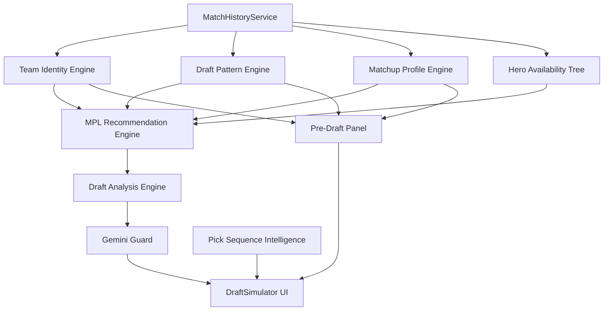

# Design Document: MPL Draft Intelligence Engine

## Overview

The MPL Draft Intelligence Engine transforms the existing generic draft recommendation system into a team-history-driven intelligence platform. It introduces **six new engine modules**, a **pre-draft UI panel**, and modifications to existing scoring/recommendation infrastructure.

### Core Design Principles

1. **Complete MPL/Ranked separation** — Two entirely independent scoring paths that share NO weight constants when team data is available.
2. **MatchHistoryService as single source of truth** — All engines derive data exclusively through the existing `MatchHistoryService.getTeamMatches()` method. No fabrication, no interpolation.
3. **Evidence-based recommendations** — Every recommendation includes source data (pickCount, winRate, game references) so the coach can verify claims.
4. **Information warfare first** — Following the AGENTS.md philosophy, bans are signals, noise is strategic, and draft concealment is prioritized.
5. **Probabilistic over deterministic** — Lane assignments and predictions use confidence percentages, not fixed orderings.

### System Context



## Architecture

### Module Dependency Graph

```
src/draft/
├── draftTypes.ts              (extended with all new interfaces)
├── teamIdentityEngine.ts      (NEW — builds team identity profiles)
├── draftPatternEngine.ts      (NEW — learns draft sequencing)
├── matchupProfileEngine.ts    (NEW — head-to-head profiles)
├── heroAvailabilityTree.ts    (NEW — downstream consequence modeling)
├── pickSequenceIntelligence.ts (NEW — probabilistic lane prediction)
├── draftAnalysisEngine.ts     (NEW — structured analysis output)
├── geminiGuard.ts             (NEW — Gemini validation layer)
├── draftScoringEngine.ts      (MODIFIED — add MPL scoring path)
├── draftRecommendationEngine.ts (MODIFIED — accept team context)
└── laneResolver.ts            (UNCHANGED)

src/components/
├── PreDraftPanel.tsx           (NEW — pre-draft intelligence UI)
└── DraftSimulator.tsx          (MODIFIED — integrate PreDraftPanel + analysis)

server.ts                       (MODIFIED — new endpoints)
```

### Data Flow Architecture

**MPL Mode Flow:**
```
Team Selection → PreDraftPanel (team summaries) → Draft Start
  → Each Step: TeamIdentity + DraftPattern + MatchupProfile + HeroAvailabilityTree
  → MPL Scoring (teamComfort + teamDeny + teamHistory + draftPattern + meta=0)
  → Recommendations with evidence + pivot predictions
  → Draft Complete → DraftAnalysisEngine → GeminiGuard → Structured Dashboard
```

**Ranked Mode Flow (UNCHANGED):**
```
Draft Start → Each Step: Meta + RoleBalance + LaneFit + Counter + Synergy + DraftPhase + DenyPick + FlexValue
  → Recommendations → Draft Complete → Gemini Analysis (existing)
```

### Scoring Priority Hierarchy

| Mode | Priority Stack (highest → lowest) |
|------|----------------------------------|
| **MPL** (team data available) | Team History → Head-to-Head → Draft Pattern → Comfort → Meta (≈0, tiebreaker only) |
| **MPL** (no team data) | Falls back to Ranked scoring |
| **Ranked** | Meta → Role Balance → Lane Balance → Counter Picks |

### Key Constraints

- The ranked scoring logic in `draftScoringEngine.ts` remains **completely untouched**. MPL scoring is a new parallel function.
- `heroes_master.json` (132 heroes) and `data/heroes/*.json` files are never modified.
- All statistics derived from `MatchHistoryService` only — never from hero JSON metadata.
- All user-facing text in Bahasa Indonesia.
- System must pass `npm run build` without errors.

## Components and Interfaces

### 1. Team Identity Engine (`src/draft/teamIdentityEngine.ts`)

**Responsibility:** Builds comprehensive identity profiles from ALL match history per team.

**Public API:**
```typescript
export function buildTeamIdentity(
  teamId: string,
  matchHistoryService: MatchHistoryService
): TeamIdentityProfile;
```

**Process:**
1. Call `matchHistoryService.getTeamMatches(teamId, {})` to get all series.
2. Iterate all games across all series.
3. For each game, determine if team was blue or red side.
4. Accumulate: hero picks (with position), hero bans, wins/losses per hero, side stats.
5. Derive: comfort heroes, first/second pick preferences, signature compositions, hero pairings, target bans, draft tendencies, most successful, most contested.

**Signature Composition Detection Algorithm:**
```
For each game, collect the set of heroes picked by the team.
For each pair (heroA, heroB) appearing together:
  Increment co-occurrence count.
  Track win/loss.
After all games:
  Filter pairs with coOccurrence >= 3 AND winRate > 50%.
  Extend to triplets by checking if any third hero co-occurs with the pair >= 3 times.
```

**Draft Tendency Classification:**
```
Analyze first-phase picks (positions 1-3 in each game).
Classify heroes by tag:
  - early_aggression: Assassins, aggressive fighters picked first phase
  - scaling: Marksmen, late-game mages picked first phase
  - flex_first: Heroes with 3+ lanes picked first phase
  - objective_control: Jungle + Tank combinations in first phase
  - split_push: Split-push fighters/assassins in first phase
Return the dominant tendency (>40% of games).
```

### 2. Draft Pattern Engine (`src/draft/draftPatternEngine.ts`)

**Responsibility:** Learns draft sequencing patterns per team.

**Public API:**
```typescript
export function buildDraftPatterns(
  teamId: string,
  matchHistoryService: MatchHistoryService
): DraftPatternProfile;

export function getSequenceAlignment(
  heroCandidate: string,
  currentPicks: string[],
  patterns: DraftPatternProfile
): number; // 0-1 alignment score
```

**Process:**
1. From all games, record the ordered pick sequence for the team (pick 1, pick 2, ... pick 5).
2. Build a frequency map: `firstPickHero → count, winRate`.
3. Build transition map: `afterHeroX → { heroY: count, heroZ: count }`.
4. Build ban sequence patterns: `ban1 → ban2 → ban3` frequency.
5. Identify avoidances: heroes in meta pool (tier S/A) that team has 0 picks.

**Sequence Alignment Scoring:**
```
Given current picks [A, B] and candidate C:
  Check if pattern "after B → C" exists with count >= 2.
  If yes: alignment = frequency(B→C) / totalGamesAfterB.
  Also check "after A → C" for earlier-position transitions.
  Return max alignment score (0-1).
```

### 3. Matchup Profile Engine (`src/draft/matchupProfileEngine.ts`)

**Responsibility:** Builds head-to-head statistical profiles.

**Public API:**
```typescript
export function buildMatchupProfile(
  teamId: string,
  opponentId: string,
  matchHistoryService: MatchHistoryService
): MatchupProfile;
```

**Process:**
1. Call `matchHistoryService.getTeamMatches(teamId, { opponent: opponentId })`.
2. From filtered series: compute h2h record, per-hero stats within that matchup.
3. Identify matchup-specific comfort heroes and priority bans.
4. Build full record with dates and results.

### 4. Hero Availability Tree (`src/draft/heroAvailabilityTree.ts`)

**Responsibility:** Models downstream consequences of ban/pick actions.

**Public API:**
```typescript
export function computePivotPredictions(
  bannedHero: string,
  enemyIdentity: TeamIdentityProfile,
  currentBans: string[],
  matchHistoryService: MatchHistoryService
): PivotPrediction;

export function computePoolCollapse(
  allBans: string[],
  enemyIdentity: TeamIdentityProfile
): PoolCollapseResult;
```

**Pivot Prediction Algorithm:**
```
Given banned hero X and enemy team identity:
1. Find the role/lane that X fills for the enemy.
2. From enemy's pick history, find other heroes that fill the same role/lane.
3. Rank alternatives by enemy's pickCount and winRate for those heroes.
4. If alternatives exist with pickCount >= 2: high confidence pivot.
5. If no clear alternatives: indicate low confidence.
6. Step 2: Given the predicted pivot hero Y, check what banning Y would further force.
```

**Pool Collapse Computation:**
```
Given all current bans against enemy:
1. From enemy identity, get their full hero pool (all picked heroes).
2. Remove banned heroes.
3. For each role/lane, compute remaining options.
4. Flag roles where remaining options < 2 as "collapsed".
```

### 5. Pick Sequence Intelligence (`src/draft/pickSequenceIntelligence.ts`)

**Responsibility:** Probabilistic lane prediction — NO fixed lane order assumption.

**Public API:**
```typescript
export function predictLanes(
  teamId: string,
  currentPicks: string[],
  teamIdentity: TeamIdentityProfile,
  matchHistoryService: MatchHistoryService
): LanePrediction[] | null; // null if < 3 picks
```

**Rules:**
- Returns `null` if `currentPicks.length < 3`.
- Does NOT assume pick order = lane order.
- For each picked hero, returns probability distribution across lanes.

**Algorithm:**
```
For each hero in currentPicks:
  1. Check team's historical lane assignments for this hero.
     (From games where team picked this hero, which lane did they play it in?)
  2. If historical data exists (>= 2 games): use that distribution.
  3. If no historical data: fall back to hero's default lanes from hero_master.
  4. Apply composition constraint: no two heroes at 100% same lane.
     Redistribute probabilities when conflicts detected.
Return array of { heroName, lanes: { Gold: 0.15, Mid: 0.85, ... } }
```

**Note:** Lane detection from match history requires inferring lane from pick position + known lane meta. Since raw data only has pick order (not lane assignment), we use hero default lanes weighted by team tendency.

### 6. Draft Analysis Engine (`src/draft/draftAnalysisEngine.ts`)

**Responsibility:** Produces structured data-driven analysis output after draft completion.

**Public API:**
```typescript
export function generateDraftAnalysis(
  bluePicks: string[],
  redPicks: string[],
  blueBans: string[],
  redBans: string[],
  blueIdentity: TeamIdentityProfile | null,
  redIdentity: TeamIdentityProfile | null,
  matchupProfile: MatchupProfile | null,
  heroDatabase: any[],
  heroesMaster: any[]
): DraftAnalysisResult;
```

**Output Sections:**
- **Team Comfort Score** — % of picks that are comfort heroes
- **Draft Execution Score** — alignment with historical draft patterns
- **Signature Pick Usage** — whether teams secured signature composition heroes
- **Comfort Hero Success Rate** — historical winRate of each secured comfort hero
- **Head-to-Head Impact** — series record context
- **Ban Efficiency** — did bans target the enemy's actual top heroes?
- **Draft Risk Analysis** — quantified risks with historical backing (e.g., "Only 1 frontline — historical WR with 1 frontline: 35%")
- **Power Spike Timeline** — early/mid/late per hero from powerSpikeTags
- **Lane Assignment** — from existing `resolveLanes()`
- **Win Condition** — derived from composition analysis
- **Evidence Source** — data files and game counts used

### 7. Gemini Guard (`src/draft/geminiGuard.ts`)

**Responsibility:** Validates Gemini AI output against local engine data.

**Public API:**
```typescript
export function validateGeminiOutput(
  geminiResponse: string,
  localAnalysis: DraftAnalysisResult,
  unavailableHeroes: string[]
): GeminiValidationResult;
```

**Validation Checks:**
1. No references to unavailable heroes (banned/picked by other team).
2. No statistical values that differ from localAnalysis computed data.
3. No hero recommendations absent from local engine's list.
4. If any check fails → discard Gemini response, use local structured data.

### 8. Pre-Draft Panel (`src/components/PreDraftPanel.tsx`)

**Responsibility:** Displays team intelligence summaries before first ban.

**Props:**
```typescript
interface PreDraftPanelProps {
  blueTeamId: string;
  redTeamId: string;
  blueIdentity: TeamIdentityProfile | null;
  redIdentity: TeamIdentityProfile | null;
  matchupProfile: MatchupProfile | null;
  heroAssets: Record<string, string>;
}
```

**Displays:**
- Top 5 comfort heroes per team (with pickCount, winRate)
- Top priority bans per team
- Head-to-head summary (games, series wins, full record)
- Signature compositions per team (with game count, winRate)
- Recent form (last 5 series winRate)
- Side preference (blue/red winRates)
- Draft tendency classification per team
- Fallback message if no data: "Data spesifik team belum tersedia. Menggunakan fallback meta."
- All labels in Bahasa Indonesia

### 9. Modified: MPL Scoring Path (`src/draft/draftScoringEngine.ts`)

**Addition:** New function `scoreMplHero()` that implements the MPL priority hierarchy.

```typescript
export function scoreMplHero(
  heroSlug: string,
  context: MplScoringContext
): MplScoreBreakdown;
```

The existing `scoreHero()` and `calculateTotalScore()` remain **untouched** for ranked mode.

**MPL Score Factors:**
| Factor | Max Points | Source |
|--------|-----------|--------|
| teamHistory | 30 | Team's winRate with this hero × 30 |
| headToHead | 25 | H2H-specific winRate × 25 |
| draftPattern | 20 | Sequence alignment score × 20 |
| teamComfort | 15 | Is hero in comfort list? 15 if yes |
| teamDeny | 10 | Is hero in enemy comfort list? 10 if yes |
| meta | 0* | Only as tiebreaker (0.01 × metaTier) |

*Meta is effectively zero. Only used to break ties between otherwise equal MPL scores.

### 10. Modified: Recommendation Engine (`src/draft/draftRecommendationEngine.ts`)

**Addition:** New function `generateMplRecommendations()`.

```typescript
export function generateMplRecommendations(
  payload: DraftRequestPayload,
  heroDatabase: any[],
  heroesMaster: any[],
  blueIdentity: TeamIdentityProfile,
  redIdentity: TeamIdentityProfile,
  matchupProfile: MatchupProfile | null,
  draftPatterns: DraftPatternProfile
): MplDraftRecommendation[];
```

Each recommendation includes:
- `heroName`, `totalScore`, `scoreBreakdown`
- `pickType`: Comfort Pick | Signature Pick | Flex Pick | Counter Pick | Deny Pick
- `banType` (for ban phase): Comfort Ban | Target Ban | Meta Ban | Deny Ban | Noise Ban
- `evidence`: `{ pickCount, winRate, source, pairingData? }`
- `pivotPrediction`: "If banned: enemy likely pivots to..."
- `fallbackBranch`: alternative hero if primary is unavailable
- `reason`: Indonesian strategic explanation

### 11. Modified: Server Endpoints (`server.ts`)

**New endpoints:**
| Endpoint | Method | Description |
|----------|--------|-------------|
| `/api/draft/team-identity/:teamId` | GET | Returns TeamIdentityProfile |
| `/api/draft/matchup/:blueTeam/:redTeam` | GET | Returns MatchupProfile |
| `/api/draft/pre-draft/:blueTeam/:redTeam` | GET | Returns combined pre-draft intelligence |
| `/api/draft/patterns/:teamId` | GET | Returns DraftPatternProfile |
| `/api/draft/analysis` | POST | Returns structured DraftAnalysisResult |

**Modified endpoint:**
- `POST /api/draft/recommendation` — Now accepts `blueTeam`/`redTeam` in payload. When both present and mode is "mpl", routes to `generateMplRecommendations()`.

## Data Models

### Core Interfaces (added to `src/draft/draftTypes.ts`)

```typescript
/** Team Identity Profile — comprehensive team DNA */
export interface TeamIdentityProfile {
  teamId: string;
  totalGames: number;
  wins: number;
  losses: number;
  winRate: number;

  /** Per-hero pick statistics */
  heroStats: Map<string, HeroPickStats>;

  /** Top 5 comfort heroes (picked >= 3 times, WR > 50%) */
  comfortHeroes: ComfortHero[];

  /** First pick preferences — heroes most often in pick position 1 */
  firstPickPreferences: PickPreference[];

  /** Second pick preferences — heroes most often in pick position 2 */
  secondPickPreferences: PickPreference[];

  /** Signature compositions — hero combos appearing together >= 3 games, WR > 50% */
  signatureCompositions: SignatureComposition[];

  /** Hero pairings — pairs drafted together in >= 2 games */
  heroPairings: HeroPairing[];

  /** Target bans per opponent */
  targetBans: Map<string, TargetBanProfile>;

  /** Draft tendency classification */
  draftTendencies: DraftTendency[];

  /** Top 5 most successful heroes (by WR, min 2 games) */
  mostSuccessfulHeroes: HeroSuccessEntry[];

  /** Top 5 most contested heroes (highest combined pick+ban frequency) */
  mostContestedHeroes: ContestedHeroEntry[];

  /** Priority bans — top 5 most banned by this team */
  priorityBans: PriorityBanEntry[];

  /** Side statistics */
  sideStats: {
    blue: { games: number; wins: number; winRate: number };
    red: { games: number; wins: number; winRate: number };
  };
}

export interface HeroPickStats {
  heroName: string;
  pickCount: number;
  winCount: number;
  lossCount: number;
  winRate: number;
  banCount: number;        // times this team banned this hero
  banAgainstCount: number; // times opponents banned this hero vs this team
  positions: number[];     // which pick positions (1-5) hero was picked in
}

export interface ComfortHero {
  heroName: string;
  pickCount: number;
  winRate: number;
  winCount: number;
}

export interface PickPreference {
  heroName: string;
  count: number;
  winRate: number;
}

export interface SignatureComposition {
  heroes: string[];      // 2-3 heroes
  gameCount: number;
  winCount: number;
  winRate: number;
}

export interface HeroPairing {
  heroA: string;
  heroB: string;
  coOccurrence: number;
  winRate: number;
}

export interface TargetBanProfile {
  opponentId: string;
  bans: Array<{ heroName: string; banCount: number }>;
}

export type DraftTendency =
  | "early_aggression"
  | "scaling"
  | "flex_first"
  | "objective_control"
  | "split_push";

export interface HeroSuccessEntry {
  heroName: string;
  winRate: number;
  gamesPlayed: number;
}

export interface ContestedHeroEntry {
  heroName: string;
  pickCount: number;
  banCount: number;
  totalContestRate: number; // (pick+ban) / totalGames
}

export interface PriorityBanEntry {
  heroName: string;
  banCount: number;
  frequency: number; // banCount / totalGames
}

/** Draft Pattern Profile */
export interface DraftPatternProfile {
  teamId: string;
  totalGames: number;

  /** First pick tendencies */
  firstPickTendencies: Array<{
    heroName: string;
    frequency: number;
    winRate: number;
  }>;

  /** Ban sequencing — common ban1→ban2→ban3 sequences */
  banSequences: Array<{
    sequence: string[];
    count: number;
  }>;

  /** Hero sequencing — after hero X, team picks hero Y */
  heroSequencing: Map<string, Array<{
    followHero: string;
    count: number;
    frequency: number; // count / totalAfterX
  }>>;

  /** Draft avoidances — meta heroes the team never picks */
  draftAvoidances: string[];
}

/** Matchup Profile — head-to-head intelligence */
export interface MatchupProfile {
  teamId: string;
  opponentId: string;
  headToHeadGames: number;
  teamSeriesWins: number;
  opponentSeriesWins: number;
  teamGameWins: number;
  opponentGameWins: number;
  headToHeadWinRate: number;

  /** Comfort heroes specific to this matchup */
  teamMatchupComfort: ComfortHero[];
  opponentMatchupComfort: ComfortHero[];

  /** Priority bans specific to this matchup */
  teamMatchupBans: PriorityBanEntry[];
  opponentMatchupBans: PriorityBanEntry[];

  /** Full record with dates */
  seriesRecord: Array<{
    date: string;
    teamScore: number;
    opponentScore: number;
    winner: string;
  }>;
}

/** Pivot Prediction from Hero Availability Tree */
export interface PivotPrediction {
  bannedHero: string;
  confidence: "high" | "medium" | "low";
  likelyPivots: Array<{
    heroName: string;
    pickCount: number;   // enemy's historical picks of this hero
    winRate: number;
    reasoning: string;   // e.g., "Same role, picked 5 times"
  }>;
  /** Step-2 prediction: if pivot hero also banned */
  secondOrderPivots?: Array<{
    ifAlsoBanned: string;
    thenPivotTo: string[];
    roleCollapse: boolean; // true if role has < 2 options left
  }>;
}

export interface PoolCollapseResult {
  totalHeroPool: number;
  remainingPool: number;
  collapsedRoles: Array<{
    role: string;
    remainingOptions: string[];
    severity: "critical" | "moderate" | "safe";
  }>;
}

/** Lane Prediction (probabilistic) */
export interface LanePrediction {
  heroName: string;
  lanes: Record<string, number>; // e.g., { "Mid": 0.85, "Gold": 0.15 }
}

/** MPL Score Breakdown (separate from ranked ScoreBreakdown) */
export interface MplScoreBreakdown {
  teamHistory: number;
  headToHead: number;
  draftPattern: number;
  teamComfort: number;
  teamDeny: number;
  meta: number; // effectively 0
}

/** MPL Draft Recommendation */
export interface MplDraftRecommendation {
  heroName: string;
  totalScore: number;
  scoreBreakdown: MplScoreBreakdown;
  lane: string;
  role: string;
  reason: string;      // Indonesian strategic explanation
  tags: string[];

  /** Pick type classification */
  pickType?: "Comfort Pick" | "Signature Pick" | "Flex Pick" | "Counter Pick" | "Deny Pick";

  /** Ban type classification (ban phase only) */
  banType?: "Comfort Ban" | "Target Ban" | "Meta Ban" | "Deny Ban" | "Noise Ban";

  /** Evidence data */
  evidence: {
    pickCount?: number;
    winRate?: number;
    source: string;        // e.g., "ONIC identity profile (15 games)"
    pairingData?: string;  // e.g., "Paired with Lancelot 4 times (75% WR)"
  };

  /** Pivot prediction for ban recommendations */
  pivotPrediction?: string; // "Jika di-ban: musuh kemungkinan beralih ke Ling, Hayabusa"

  /** Fallback branch */
  fallbackBranch?: {
    heroName: string;
    reason: string;
  };
}

/** Structured Draft Analysis Result */
export interface DraftAnalysisResult {
  teamComfortScore: {
    blue: { score: number; comfortPicks: string[]; totalPicks: number };
    red: { score: number; comfortPicks: string[]; totalPicks: number };
  };
  draftExecutionScore: {
    blue: { score: number; patternAlignment: string };
    red: { score: number; patternAlignment: string };
  };
  signaturePickUsage: {
    blue: { secured: string[]; missed: string[] };
    red: { secured: string[]; missed: string[] };
  };
  comfortHeroSuccessRate: {
    blue: Array<{ heroName: string; historicalWinRate: number }>;
    red: Array<{ heroName: string; historicalWinRate: number }>;
  };
  headToHeadImpact: {
    totalGames: number;
    blueSeriesWins: number;
    redSeriesWins: number;
    narrative: string; // Indonesian
  };
  banEfficiency: {
    blue: { score: number; targetedHighValue: string[]; wasted: string[] };
    red: { score: number; targetedHighValue: string[]; wasted: string[] };
  };
  draftRiskAnalysis: {
    blue: Array<{ risk: string; historicalWinRate: number }>;
    red: Array<{ risk: string; historicalWinRate: number }>;
  };
  powerSpikeTimeline: {
    blue: Array<{ heroName: string; spike: "early" | "mid" | "late" }>;
    red: Array<{ heroName: string; spike: "early" | "mid" | "late" }>;
  };
  laneAssignment: {
    blue: Record<string, string | null>;
    red: Record<string, string | null>;
  };
  winCondition: {
    blue: string; // Indonesian
    red: string;
  };
  evidenceSource: {
    dataFiles: string[];
    totalGamesAnalyzed: number;
    teamGamesUsed: { blue: number; red: number };
  };
}

/** Gemini Validation Result */
export interface GeminiValidationResult {
  isValid: boolean;
  violations: string[];
  sanitizedOutput: string | null; // null if invalid, use local data
}

/** Extended DraftRequestPayload for MPL mode */
export interface MplDraftRequestPayload extends DraftRequestPayload {
  blueTeam?: string;
  redTeam?: string;
}
```

## Correctness Properties

*A property is a characteristic or behavior that should hold true across all valid executions of a system — essentially, a formal statement about what the system should do. Properties serve as the bridge between human-readable specifications and machine-verifiable correctness guarantees.*

### Property 1: Hero pick statistics are mathematically consistent

*For any* set of match history games processed by TeamIdentityEngine, the computed `pickCount` for each hero SHALL equal the number of games where that hero appears in the team's picks, `winCount + lossCount` SHALL equal `pickCount`, and `winRate` SHALL equal `winCount / pickCount * 100`.

**Validates: Requirements 1.1, 1.13**

### Property 2: Ban statistics accumulate correctly

*For any* set of match history games, `banCount` for each hero SHALL equal the number of games where the team banned that hero, and `banAgainstCount` SHALL equal the number of games where the opponent banned that hero against this team.

**Validates: Requirements 1.2**

### Property 3: Filtered top-N lists satisfy their criteria

*For any* set of hero statistics, ALL returned comfort heroes SHALL have `pickCount >= 3` AND `winRate > 50`, ALL returned most-successful heroes SHALL have `gamesPlayed >= 2`, ALL returned priority bans SHALL be sorted by `banCount` descending, and no list SHALL exceed 5 entries.

**Validates: Requirements 1.3, 1.11, 1.14**

### Property 4: Pick position preferences match frequency counts

*For any* set of games, the first pick preferences SHALL contain exactly the heroes that appear most frequently at pick position 1, and second pick preferences at position 2, with frequency counts matching the actual occurrences.

**Validates: Requirements 1.4, 1.5**

### Property 5: Signature compositions satisfy co-occurrence and win rate thresholds

*For any* set of games processed by TeamIdentityEngine, ALL returned signature compositions SHALL have `gameCount >= 3` (hero combination appearing together in >= 3 games) AND `winRate > 50%`.

**Validates: Requirements 1.7, 1.8**

### Property 6: Side statistics are consistent with game outcomes

*For any* set of match history games, `sideStats.blue.games + sideStats.red.games` SHALL equal `totalGames`, and `sideStats.blue.wins + sideStats.red.wins` SHALL equal total `wins`, and each side's `winRate` SHALL equal `wins / games * 100` for that side.

**Validates: Requirements 1.6, 1.13**

### Property 7: Matchup profile statistics are correct for the filtered subset

*For any* pair of teams with head-to-head games, `headToHeadGames` SHALL equal the total game count from filtered series, `teamSeriesWins + opponentSeriesWins` SHALL equal the total number of series, and `headToHeadWinRate` SHALL equal `teamSeriesWins / totalSeries * 100`.

**Validates: Requirements 2.1, 2.2**

### Property 8: MPL scoring assigns zero or negligible meta weight when team data exists

*For any* hero scored in MPL mode with non-empty team identity data, the `meta` component of `MplScoreBreakdown` SHALL be less than 1% of the maximum possible total score (i.e., meta is effectively a tiebreaker only).

**Validates: Requirements 3.5, 3.6, 9.1, 9.4**

### Property 9: Ranked scoring contains no team-based factors

*For any* hero scored in Ranked mode, the score breakdown SHALL use the existing `ScoreBreakdown` structure (laneFit, roleBalance, counter, synergy, meta, draftPhase, denyPick, flexValue) with zero contribution from teamHistory, headToHead, draftPattern, or teamComfort factors.

**Validates: Requirements 3.8, 9.2**

### Property 10: All recommendations only include available heroes

*For any* draft state (set of bans and picks), ALL returned recommendations (both MPL and Ranked) SHALL NOT contain any hero that is in the union of `blueBans ∪ redBans ∪ bluePicks ∪ redPicks`.

**Validates: Requirements 6.6, 8.1**

### Property 11: Every MPL recommendation has valid type classification and evidence

*For any* MPL recommendation generated, the `pickType` (during pick phase) SHALL be one of {Comfort Pick, Signature Pick, Flex Pick, Counter Pick, Deny Pick}, the `banType` (during ban phase) SHALL be one of {Comfort Ban, Target Ban, Meta Ban, Deny Ban, Noise Ban}, and `evidence` SHALL be non-null with `source` field populated.

**Validates: Requirements 5.2, 5.3, 6.2, 6.3**

### Property 12: Ban recommendations include at least one noise ban

*For any* set of MPL ban recommendations generated when enemy team identity exists, at least one recommendation SHALL have `banType === "Noise Ban"`.

**Validates: Requirements 5.4**

### Property 13: Draft pattern hero sequencing counts match actual transitions

*For any* set of games processed by DraftPatternEngine, the hero sequencing map entry `afterHeroX → followHeroY: count` SHALL equal the actual number of games where Y immediately follows X in the team's pick sequence.

**Validates: Requirements 10.3**

### Property 14: Draft avoidances are heroes in meta pool with zero or near-zero picks

*For any* team's draft pattern profile, ALL heroes in `draftAvoidances` SHALL have a meta tier of S or A AND the team's `pickCount` for that hero SHALL be 0 or less than 1% of `totalGames`.

**Validates: Requirements 10.4**

### Property 15: Lane predictions are null below threshold and probabilistic above

*For any* set of picks, if `picks.length < 3` then `predictLanes()` SHALL return `null`. If `picks.length >= 3`, the returned lane predictions SHALL be non-null AND for each hero's lane distribution, the sum of all probabilities SHALL equal approximately 1.0 (within floating point tolerance of 0.01).

**Validates: Requirements 11.3, 11.4**

### Property 16: Hero pool collapse correctly computes remaining options

*For any* set of bans applied against an enemy team identity, `remainingPool` SHALL equal `totalHeroPool - bannedHeroes` (only counting heroes the enemy has actually picked historically), and roles flagged as "critical" SHALL have `remainingOptions.length < 2`.

**Validates: Requirements 12.2**

### Property 17: Pivot predictions reference only heroes from enemy's actual history

*For any* pivot prediction generated by HeroAvailabilityTree, ALL heroes in `likelyPivots` SHALL exist in the enemy team's `heroStats` map (i.e., they have been picked by the enemy at least once in match history).

**Validates: Requirements 12.1, 12.3**

### Property 18: Gemini Guard detects unavailable hero references

*For any* Gemini output string containing a hero name that is in the `unavailableHeroes` set, `validateGeminiOutput()` SHALL return `isValid: false` with the violation listed.

**Validates: Requirements 8.1, 8.3**

### Property 19: Draft analysis structure contains all required sections

*For any* completed draft state processed by DraftAnalysisEngine, the output SHALL contain non-null values for ALL fields: `teamComfortScore`, `draftExecutionScore`, `signaturePickUsage`, `comfortHeroSuccessRate`, `headToHeadImpact`, `banEfficiency`, `draftRiskAnalysis`, `powerSpikeTimeline`, `laneAssignment`, `winCondition`, `evidenceSource`.

**Validates: Requirements 7.1**

### Property 20: Team Comfort Score is percentage of comfort picks

*For any* draft state with team identity available, `teamComfortScore.score` SHALL equal `(comfortPicks.length / totalPicks) * 100` where `comfortPicks` are the intersection of the team's picks with their comfort hero list.

**Validates: Requirements 7.2**

## Error Handling

### Engine-Level Error Handling

| Scenario | Handling | Fallback |
|----------|----------|----------|
| MatchHistoryService returns empty data | Return empty/default profiles | All engines gracefully degrade |
| Team not found in match history | Return null identity | Recommendation falls back to ranked scoring |
| No h2h games between teams | Return MatchupProfile with `headToHeadGames: 0` | Pre-draft panel shows h2h section as empty |
| Hero not found in hero database | Skip hero in scoring loop | Continue with remaining heroes |
| HeroAvailabilityTree has no alternatives | Return `confidence: "low"` | UI shows "Prediksi pivot tidak tersedia" |
| Gemini API fails/timeout | GeminiGuard returns local data | UI renders local structured analysis |
| Gemini output fails validation | Discard response | Use DraftAnalysisEngine local output |
| Invalid team selection (same team both sides) | Reject at API level | Return 400 error |
| Draft state corruption (duplicate heroes) | Validate at recommendation entry | Filter duplicates before scoring |

### API-Level Error Responses

```typescript
// All new endpoints return this structure on error:
interface ApiErrorResponse {
  error: string;       // Machine-readable error code
  message: string;     // Bahasa Indonesia human-readable message
  fallback?: any;      // Optional fallback data
}
```

### Graceful Degradation Chain

```
Full MPL Intelligence (all engines active)
  → Team Identity only (no matchup, no patterns) if opponent not in data
    → Ranked scoring (no team data at all) if team not in data
      → Empty recommendations if hero database fails
```

## Testing Strategy

### Dual Testing Approach

This feature uses both **property-based tests** (for universal correctness guarantees) and **unit tests** (for specific examples and edge cases).

### Property-Based Testing

**Library:** [fast-check](https://github.com/dubzzz/fast-check) for TypeScript

**Configuration:**
- Minimum 100 iterations per property test
- Each test tagged with: `Feature: mpl-draft-intelligence, Property {N}: {title}`

**Test Files:**
- `src/draft/__tests__/teamIdentityEngine.property.test.ts`
- `src/draft/__tests__/draftPatternEngine.property.test.ts`
- `src/draft/__tests__/matchupProfileEngine.property.test.ts`
- `src/draft/__tests__/heroAvailabilityTree.property.test.ts`
- `src/draft/__tests__/pickSequenceIntelligence.property.test.ts`
- `src/draft/__tests__/mplScoring.property.test.ts`
- `src/draft/__tests__/geminiGuard.property.test.ts`
- `src/draft/__tests__/draftAnalysisEngine.property.test.ts`

**Generators:**
- `arbitraryGame()` — generates a random Game with valid hero picks/bans
- `arbitrarySeries()` — generates SeriesMatch with 2-5 games
- `arbitraryMatchHistory(teamId)` — generates MatchHistoryResponse for a team
- `arbitraryTeamIdentity()` — generates TeamIdentityProfile with valid constraints
- `arbitraryDraftState()` — generates valid DraftRequestPayload (no duplicates across bans/picks)

### Unit Tests (Example-Based)

**Focus areas:**
- Edge cases: empty match history, single game, team with 0 wins
- Pre-Draft Panel rendering with known fixture data (ONIC vs GEEK from actual dataset)
- Gemini Guard with crafted invalid outputs
- Integration: full recommendation flow with real dataset subset
- API endpoint contract tests

**Test Files:**
- `src/draft/__tests__/teamIdentityEngine.test.ts`
- `src/draft/__tests__/draftPatternEngine.test.ts`
- `src/draft/__tests__/matchupProfileEngine.test.ts`
- `src/draft/__tests__/heroAvailabilityTree.test.ts`
- `src/draft/__tests__/pickSequenceIntelligence.test.ts`
- `src/draft/__tests__/geminiGuard.test.ts`
- `src/draft/__tests__/draftAnalysisEngine.test.ts`
- `src/components/__tests__/PreDraftPanel.test.tsx`

### Integration Tests

- Full MPL recommendation flow: team selection → pre-draft → step-by-step recommendations → final analysis
- Server endpoint tests with real normalized dataset
- Build verification: `npm run build` passes without errors

