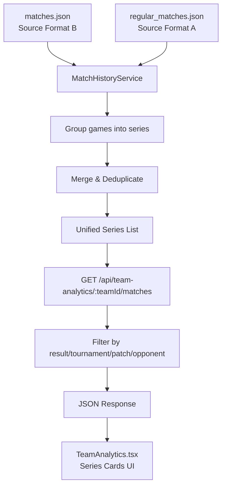

# Design Document: Team Analytics Match History

## Overview

This design addresses the broken Match History tab in the Team Analytics page. The core problem is that `matches.json` stores flat individual game entries while the UI expects grouped series data. The solution introduces a server-side `MatchHistoryService` that groups games into series, merges with `regular_matches.json`, deduplicates, and exposes a new filtered API endpoint. The frontend is updated to consume this endpoint and render expandable series cards.

## Architecture



**Data Flow:**
1. Server reads both JSON files at startup (cached in memory)
2. `MatchHistoryService` processes Source Format B into grouped series
3. Source Format A series are normalized to the same internal model
4. Both are merged and deduplicated
5. API endpoint filters by team and optional parameters
6. Frontend fetches from new endpoint and renders expandable series cards

## Components and Interfaces

### MatchHistoryService (server-side)

Located at: `src/services/matchHistoryService.ts`

```typescript
export interface SeriesMatch {
  id: string;
  tournament: string;
  date: string;
  patch: string;
  teamA: string;
  teamB: string;
  teamAScore: number;
  teamBScore: number;
  winner: string;
  loser: string;
  format: "BO3" | "BO5";
  games: Game[];
}

export interface Game {
  gameNumber: number;
  blueTeam: string;
  redTeam: string;
  winner: string;
  loser: string;
  duration: string;
  patch: string;
  bluePicks: string[];
  redPicks: string[];
  blueBans: string[];
  redBans: string[];
}

export interface MatchHistoryResponse {
  totalMatches: number;
  filteredMatches: number;
  wins: number;
  losses: number;
  winrate: number;
  series: SeriesMatch[];
  gamesCount: number;
}

export interface MatchHistoryFilters {
  result?: "all" | "win" | "lose";
  tournament?: string;
  patch?: string;
  opponent?: string;
}

export class MatchHistoryService {
  private allSeries: SeriesMatch[];

  constructor();
  
  /** Load and process both data sources */
  loadData(): void;

  /** Group flat games (Source Format B) into series */
  groupGamesIntoSeries(flatGames: SourceFormatBEntry[]): SeriesMatch[];

  /** Convert Source Format A entries to SeriesMatch */
  convertSourceA(entries: SourceFormatAEntry[]): SeriesMatch[];

  /** Merge and deduplicate series from both sources */
  mergeAndDeduplicate(seriesA: SeriesMatch[], seriesB: SeriesMatch[]): SeriesMatch[];

  /** Get filtered match history for a specific team */
  getTeamMatches(teamId: string, filters: MatchHistoryFilters): MatchHistoryResponse;

  /** Split a draft array of 10 heroes into picks (first 5) and bans (last 5) */
  splitDraft(draft: string[]): { picks: string[]; bans: string[] };

  /** Determine series format based on game count */
  determineFormat(gameCount: number): "BO3" | "BO5";

  /** Determine series winner from game results */
  determineSeriesWinner(games: { winner: string }[], teamA: string, teamB: string): { winner: string; loser: string; teamAScore: number; teamBScore: number };
}
```

### Source Format Interfaces

```typescript
/** Raw entry from matches.json */
export interface SourceFormatBEntry {
  date: string;
  tournament: string;
  team1: string;
  draft1: string[]; // 10 heroes: first 5 picks, last 5 bans
  team2: string;
  draft2: string[]; // 10 heroes: first 5 picks, last 5 bans
  winner: string;
  length: string;
  patch: string;
}

/** Raw entry from regular_matches.json */
export interface SourceFormatAEntry {
  match: string;
  blueTeam: string;
  redTeam: string;
  score: string;
  date: string;
  mvp: string;
  games: {
    game: number;
    winner: string;
    score: string;
    duration: string;
    map: string;
    blueTeam: { name: string; picks: string[]; bans: string[] };
    redTeam: { name: string; picks: string[]; bans: string[] };
  }[];
}
```

### API Endpoint

**Route:** `GET /api/team-analytics/:teamId/matches`

**Parameters:**
- `:teamId` - Team key (e.g., "RRQ", "ONIC")
- `?result=all|win|lose` - Filter by series result (default: "all")
- `?tournament=string` - Filter by tournament name
- `?patch=string` - Filter by patch version
- `?opponent=string` - Filter by opponent team key

**Response:** `MatchHistoryResponse` JSON

### Frontend Component Updates

`TeamAnalytics.tsx` Match History tab updates:
- Replace dual fetch (`/api/matches` + `/api/history`) with single fetch to `/api/team-analytics/:teamId/matches`
- Remove client-side merging/grouping logic
- Add expandable series card component
- Filter controls send query params to API
- Remove inline debug text; add dev-mode collapsible panel

## Data Models

### SeriesMatch

| Field | Type | Description |
|-------|------|-------------|
| id | string | Unique identifier (hash of date+teamA+teamB+gameCount) |
| tournament | string | Tournament name |
| date | string | ISO date string (YYYY-MM-DD) |
| patch | string | Game patch version |
| teamA | string | Normalized team key (blue side in first game) |
| teamB | string | Normalized team key (red side in first game) |
| teamAScore | number | Games won by teamA |
| teamBScore | number | Games won by teamB |
| winner | string | Normalized team key of series winner |
| loser | string | Normalized team key of series loser |
| format | "BO3" \| "BO5" | Series format based on game count |
| games | Game[] | Array of games in this series |

### Game

| Field | Type | Description |
|-------|------|-------------|
| gameNumber | number | Sequential number (1, 2, 3...) |
| blueTeam | string | Normalized team key on blue side |
| redTeam | string | Normalized team key on red side |
| winner | string | Normalized team key of game winner |
| loser | string | Normalized team key of game loser |
| duration | string | Game duration (e.g., "19:43") |
| patch | string | Patch version |
| bluePicks | string[] | 5 hero picks for blue side |
| redPicks | string[] | 5 hero picks for red side |
| blueBans | string[] | 5 hero bans from blue side |
| redBans | string[] | 5 hero bans from red side |

### Grouping Algorithm

```
Input: flat game entries sorted by appearance order
Output: SeriesMatch[]

1. Normalize team names for each entry
2. Create grouping key: sortedTeams(normalize(team1), normalize(team2)) + date
3. Group entries by grouping key (preserving order)
4. For each group:
   a. If group.length <= 5: create single series
   b. If group.length > 5: split into chunks of 3 (BO3) or 5 (BO5)
5. For each series:
   a. Assign sequential gameNumbers 1..N
   b. Count wins per team → determine winner/loser
   c. Compute score "winnerWins-loserWins"
   d. Determine format: 2-3 games = BO3, 4-5 games = BO5
   e. Generate unique id
```

### Deduplication Algorithm

```
Input: mergedSeries (from Source A + Source B)
Output: deduplicated SeriesMatch[]

1. For each series, compute dedup key: normalize(teamA) + normalize(teamB) + date + gameCount
2. Keep first occurrence for each dedup key
3. Sort by date descending
```

## Correctness Properties

*A property is a characteristic or behavior that should hold true across all valid executions of a system—essentially, a formal statement about what the system should do. Properties serve as the bridge between human-readable specifications and machine-verifiable correctness guarantees.*

### Property 1: Grouping preserves all games

*For any* list of flat game entries from Source Format B, after grouping into series, the total number of games across all series SHALL equal the number of input entries.

**Validates: Requirements 1.1**

### Property 2: Game numbers are sequential within each series

*For any* series produced by the grouping algorithm, the game numbers SHALL be exactly [1, 2, ..., N] where N is the number of games in that series.

**Validates: Requirements 1.2, 6.2**

### Property 3: Series winner has majority of game wins

*For any* series produced by the grouping algorithm, the series winner SHALL be the team that won strictly more than half of the games in that series.

**Validates: Requirements 1.3**

### Property 4: Series score matches game win counts

*For any* series with winner W and loser L, the score string SHALL be "X-Y" where X equals the count of games won by W and Y equals the count of games won by L, and X > Y.

**Validates: Requirements 1.4**

### Property 5: Draft splitting produces correct picks and bans

*For any* 10-element draft array, splitting SHALL produce picks equal to the first 5 elements and bans equal to the last 5 elements.

**Validates: Requirements 1.5, 1.6**

### Property 6: Deduplication removes exact duplicates only

*For any* merged series list, after deduplication the output SHALL contain no two series with the same date + same teams + same game count, and the output size SHALL be less than or equal to the input size.

**Validates: Requirements 2.2**

### Property 7: Team name normalization is idempotent

*For any* team name string, applying normalizeTeamName twice SHALL produce the same result as applying it once.

**Validates: Requirements 2.3**

### Property 8: Output is sorted by date descending

*For any* output from the merge-and-deduplicate step, each series date SHALL be less than or equal to the previous series date.

**Validates: Requirements 2.4**

### Property 9: Win filter returns only series where team is winner

*For any* team and any set of series data, filtering with result="win" SHALL return only series where the winner field equals the specified team, and SHALL return all such series.

**Validates: Requirements 3.3, 4.1**

### Property 10: Lose filter returns only series where team is loser

*For any* team and any set of series data, filtering with result="lose" SHALL return only series where the loser field equals the specified team, and SHALL return all such series.

**Validates: Requirements 3.4, 4.2**

### Property 11: All filter returns all series involving the team

*For any* team and any set of series data, filtering with result="all" SHALL return exactly those series where teamA or teamB equals the specified team.

**Validates: Requirements 3.5**

### Property 12: Format assignment matches game count

*For any* series, if it has 2 or 3 games the format SHALL be "BO3", and if it has 4 or 5 games the format SHALL be "BO5".

**Validates: Requirements 6.1**

### Property 13: Overflow groups are split into valid series

*For any* group of games with the same grouping key that contains more than 5 games, splitting SHALL produce series where each has between 2 and 5 games.

**Validates: Requirements 6.3**

## Error Handling

| Scenario | Handling |
|----------|----------|
| `matches.json` missing or unreadable | Log warning, continue with empty Source B data |
| `regular_matches.json` missing or unreadable | Log warning, continue with empty Source A data |
| Invalid team ID in API request | Return empty response with 0 counts (not 404) |
| Malformed draft array (not 10 elements) | Use available elements; pad with empty strings if < 10 |
| Game entry with missing winner field | Skip entry, log warning |
| Date parsing failure | Use raw date string as-is for sorting/grouping |
| Both data sources empty | Return valid empty response |

## Testing Strategy

### Property-Based Tests (using fast-check)

Property-based testing is appropriate here because:
- The core logic (grouping, splitting, filtering, deduplication) consists of pure functions with clear input/output behavior
- There are universal properties that hold across all valid inputs
- The input space is large (varying team names, dates, game counts, winners)

**Configuration:**
- Library: `fast-check` (TypeScript/JavaScript PBT library)
- Minimum 100 iterations per property
- Each test tagged with: `Feature: team-analytics-match-history, Property N: <title>`

**Property tests to implement:**
1. Property 1: Grouping preserves game count
2. Property 2: Sequential game numbers
3. Property 3: Series winner has majority
4. Property 4: Score string correctness
5. Property 5: Draft split correctness
6. Property 6: Deduplication correctness
7. Property 7: Team name normalization idempotence
8. Property 8: Date descending sort
9. Property 9: Win filter correctness
10. Property 10: Lose filter correctness
11. Property 11: All filter correctness
12. Property 12: Format assignment
13. Property 13: Overflow split validity

### Unit Tests (using vitest)

- Specific examples with known MPL ID team data
- Edge cases: single-game series, exactly 5 games, 6+ games overflow
- Error conditions: missing fields, malformed data

### Integration Tests

- API endpoint returns correct response shape
- Frontend renders series cards from mock API data
- Filter controls update query params correctly

### Dev Dependencies

- `fast-check` for property-based testing
- `vitest` as test runner (already compatible with Vite project)
